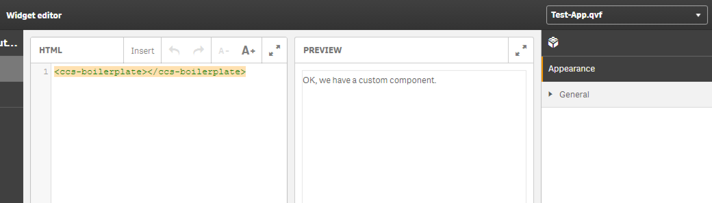
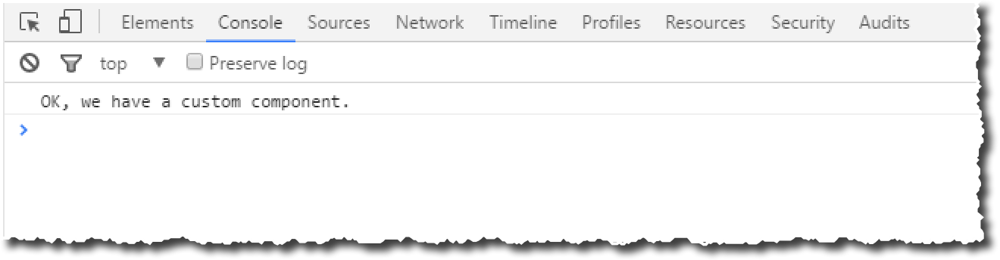
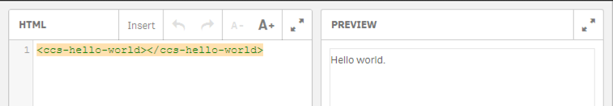
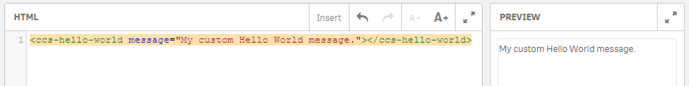
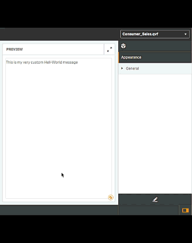
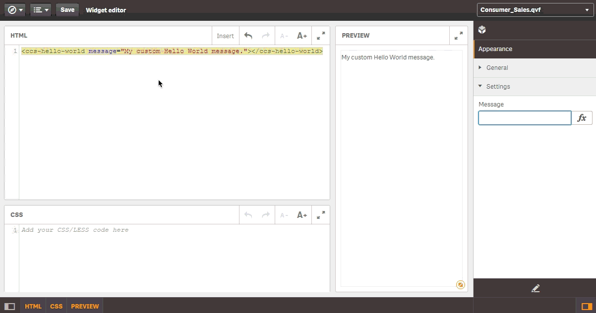
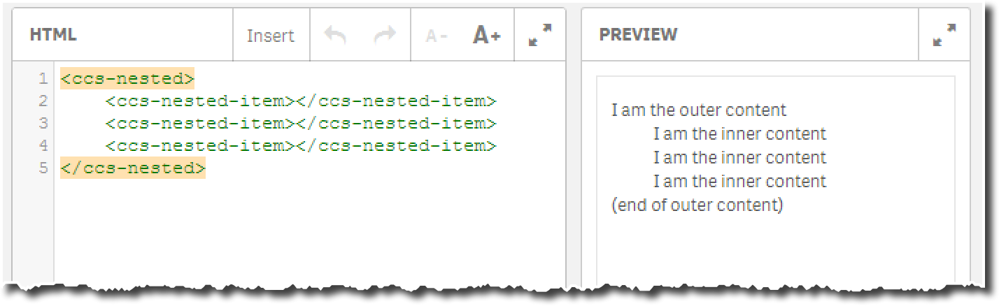

# custom-components-tutorial

> Getting Started with Custom Components for Qlik Sense.

- [Using AngularJS Services](#using-angularjs-services)
- [Default Values for Scope Properties](#default-values-for-scope-properties)

_(TOC generated by [verb](https://github.com/verbose/verb) using [markdown-toc](https://github.com/jonschlinkert/markdown-toc))_

# Introduction to the Concept of Custom Components

Custom Components are a new concept introduced with version 3.1 of Qlik Sense.
The main purpose of Custom Components is to empower Widget creators with more available components which can then be used in a declarative way.
Such a component could be a slider, a date-picker or anything else which encapsulates some common and re-usable functionality.

The approach of developing Custom Components is similar to the Visualization Extension concept, by using Custom Component API you can make use of the full power of web programming capabilities.

The introduction of the Custom Component API does not contradict the main goal of Widgets ("Create new visualization without the need of programming"), it even emphasizes this approach by allowing developers to provide powerful components to Widgets creates, which empowers Widget creators.

As of Qlik Sense 3.1 the concept of Custom Components is only targeted for Widgets, this might change in the future. It could be that Custom Components can be used in other concepts such as Visualization Extensions, Mashups and other ways of extending the product.

# Installation & Usage

Before we start developing a new Custom Component, let's have a look how Custom Components are installed and used.

## Installation

Technically speaking Custom Components are a new extension type, therefore the installation of a Custom Component is exactly the same compared to installing a Visualization Extension.

### Installation using Qlik Sense Desktop

Follow the instructions as published here.

### Installation using Qlik Sense Server

Follow the instructions as published here.

## Usage

As soon as a Custom Component is installed, you can immediately use it in the Widget editor.

{{hint}}
Make sure that you reload the Widget editor after you have installed a new Custom Component, as Custom Components are loaded at the same time as the Widget editor loads its UI.
{{/hint}}

### Example

* [Download the sample component "ccs-boilerplate"](docs/downloads/ccs-boilerplate.zip) and install it on either Qlik Sense Desktop or Qlik Sense Server.
* Start the Widget editor and create a new widget (either in a new or existing Widget library).
* In _HTML_ enter the following code

```html
<ccs-boilerplate></ccs-boilerplate>
```

* After having selected any app, you should see the following in the _Preview_:



* Furthermore if you open the developer console of your browser you should see the following:



OK; perfect, a very basic Custom Component now works, let's have a look in the next chapter to this was done.

# The Custom Component API

The Custom Component API follows the same principles as when developing a Visualization Extension.

If you have never created Visualization Extension, it is highly recommended that you first have a look at the following document:

* [Getting started building visualization extensions](http://help.qlik.com/en-US/sense-developer/3.0/Subsystems/Extensions/Content/extensions-getting-started.htm)

## Ingredients of a Custom Component

A Custom Components contains the following elements:

* A definition file (.qext file)
* A main JavaScript file
* Other (optional) assets, such as JavaScript libraries, images, fonts, etc.

### The Definition File

* The definition file is the main entry point for Qlik Sense to load a custom component.
* A definition file always uses the file-extension `.qext`

Example:

```js
{
  "name": "ccs-boilerplate",
  "description": "Boilerplate for a custom component.",
  "type": "component",
  "version": "0.1.0",
  "author": "Stefan Walther"
}
```

The following properties are mandatory for a valid definition file:

* **`name`** - The name of the custom component.
* **`description`** - Any meaningful description for your component. Not used anywhere in the product right now, but important for future versions of Qlik Sense.
* **`type`** - Type of the extension, should be always `component` for Custom Components.
* **`version`** - Version of your Custom Component, uses the concept of [Semantic Versioning](http://semver.org/) .
* **`author`** - Some information about the author.

{{hint}}
Further properties can be added to the `.qext` file and it is highly encouraged to do so. Additional properties provide very helpful information
Follow the standards of [npm's package.json definition](https://docs.npmjs.com/files/package.json).
{{/hint}}

### The Main JavaScript File

Custom Components are (right now) basically AngularJS directives.
The purpose of the JavaScript file is to return the signature of an AngularJS directive.

Example:

```js
define( [], function () {
    'use strict';
    
    return {
        name: "ccsBoilerplate",
        restrict: 'E',
        link: function ( scope, element, attrs ) {
            element.html( 'OK, we have a custom component.' );
            console.log( 'OK, we have a custom component.' );
        }
    };
} );
```

{{hint}}
Technically speaking it would work also to register your directive with `qvangular.directive( ...` but you should never do so, because the concept of Custom Components could be extended in the future far beyond just AngularJS directives.
{{/hint}}

#### Naming of the Component's name (camelCase)

The property `name` should match what you have defined in your `.qext` file.
But if you compare the `name` property of the `.qext` file with the `name` property of the JavaScript file, you'll see a difference:

* `name` property of the `.qext` file: `ccs-boilerplate`
* `name` property of the JavaScript file: `ccsBoilerplate`

We have already seen in the previous chapter that one would use the Custom Component with the `<ccs-boilerplate></ccs-boilerplate>` Html elment.
The reason for the difference between the AngularJS directive signature and the definition file is that AngularJS follows the principle of [camelCase](http://en.wikipedia.org/wiki/CamelCase) .

> Angular normalizes an element's tag and attribute name to determine which elements match which directives. We typically refer to directives by their case-sensitive camelCase normalized name (e.g. ngModel). However, since HTML is case-insensitive, we refer to directives in the DOM by lower-case forms, typically using dash-delimited attributes on DOM elements (e.g. ng-model).
(taken from the  [AngularJS documentation: directives](https://docs.angularjs.org/guide/directive))

### Prefixes for your Custom Component

The given example of `ccs-boilerplate` uses the prefix `ccs` (which stands for **c**ustom **c**omponents **c**ample).
Use prefixes of your Custom Components to prevent conflict with components created by other developers.

You should not used the prefix `qw`, which is reserved for Custom Components provided by Qlik, such as `qw-sys-info`.

# Hello World Component

## Objective

Let's create a 'Hello World' component, including some of the basic concepts of the Custom Component API.

## Let's get Started

As a start we use the boilerplate and modify the name and the default output.
The prefix for the component is again `ccs` (which stands for **c**ustom **c**omponent **s**ample), just to prevent conflicts with any further components.

The `ccs-hello-world.qext` file:

```js
{
  "name": "ccs-hello-world",
  "description": "The very exciting Hello World component.",
  "type": "component",
  "version": "0.1.0",
  "author": "Stefan Walther"
}
```

The `ccs-hello-world.js` file:

```js
define( [], function () {
    'use strict';

    return {
        name: "ccsBoilerplate",
        restrict: 'E',
        link: function ( scope, element, attrs ) {
            element.html( 'Hello world.' );
        }
    };
} );
```

Using `ccs-hello-world`:

After having imported `ccs-hello-world` we can use it in the Widget editor:



Not really exciting, but let's review some of the basic concepts of this very simple example:

* As mentioned above we return the signature of an AngularJS directive in our Custom Component.
* The property `name` defines the name of the component, using the [camelCase](http://en.wikipedia.org/wiki/CamelCase) concept.
* The property `restrict` with the value `E` declares that we can use the component straight aways like a native Html element. (Other options are possible, [read here](https://docs.angularjs.org/guide/directive) ).
* The `link` function provides [low level access to manipulate](https://docs.angularjs.org/guide/directive#creating-a-directive-that-manipulates-the-dom) the [DOM](https://en.wikipedia.org/wiki/Document_Object_Model):
  - This, it provides access to the following objects
    + `scope` - The AngularJS scope.
    + `element` - The [jqLite-wrapped element](https://docs.angularjs.org/api/ng/function/angular.element) that this directive matches.
    + `attrs` - A hash object with key-value pairs of normalized attribute names and their corresponding attribute values.
* As the function `link` provides access to the `element` and therefore and [html](https://docs.angularjs.org/api/ng/function/angular.element#angular-s-jqlite)`html` method , we are manipulating the HTML content of the current component with `element.html( 'Hello world.' );

OK, all fine, but not really useful in the context of the Widget concept.
Let's go one step further and allow the Widget creator to customize the "Hello-World" message.

## Customize the Hello-World Message

{{hint}}
Following the power of AngularJS' directives there are several ways to achieve the same result. This example just shows one of the possible solutions.
But this example is following some best practices when working with Custom Components & Widgets.
{{/hint}}

### Objective

We'd like the user to allow defining the message within a Widget:

```html
<ccs-hello-world message="This is my very custom Hello-World message." />
```

which should result into:



To achieve the desired result, let's add an one-way binded attribute `message` to the scope of our component:

```js
    var component = {
        name: "ccsHelloWorld",
        restrict: 'E',
        scope: {
            message: '@'
        },
        link: function ( scope, element, attrs ) {
            
            // Now let's see what we have in our scope
            console.log( 'Custom message: ', scope.message );
            
        }
    };
```

For newbies in AngularJS just these few lines introduced quite a lot of new concepts, let's have a look at them one by one:

**The scope:**

The scope is one of the core concepts of AngularJS. The scope is the connecting piece between your HTML and your JavaScript based component.
Think of the scope as a container of objects (with properties and values). These objects are used for data-binding, so bringing your HTML pieces together with what you have defined in your component.

**One way binding:**

The binding of scope properties in AngularJS is very powerful, but can also be pretty complicated.
Think of the "one-way-binding" for now as follows:

* We'd like to define the properties in a Widget
* We'd like to use the values of the properties in a Custom Component
* We want to prevent that property values are propagated to outside the boundaries of a Custom Component (e.g. the entire Qlik Sense client)

**Just forget it, for now:**

Don't let yourself get confused by these new concepts, for now we could just simplify our changes to:

* We have defined a property called `message` in our component.
* This property called `message` can be set in a Widget using the attribute `message`.
* We are then fine to use this property within our component using `scope.message`.

Considering this simplification let's change the component as follows:

```js
    var component = {
        name: "ccsHelloWorld",
        restrict: 'E',
        scope: {
            message: '@'
        },
        link: function ( scope, element, attrs ) {
            
            element.html( scope.message );
            
        }
    };
```

Which would result into:


### Creating a Fully Customizable Widget

As the main and only usage scenario for a Custom Component is (right now, as of Qlik Sense 3.1) to empower Widget creators, we should think of making the Widget using our component as generic as possible.
Using `ccs-hello-world` in the Widget editor and changing the property `message` is nice, but it doesn't make our Widget generic.
So let's transfer all the power to the Widget creator and let's create a fully customizable Widget using the new component `ccs-hello-world`:

First let's create a property named `settings.message` using the Property Panel Builder:



The next step would be to bind the newly property `settings.message` in the Widget editor to the `ccs-hello-world` component:



Which results into:

```html
<ccs-hello-world message="{{settings.message}}"></ccs-hello-world>
```

If you were following the steps above, you have probably realized that we are still missing one piece:

* If you are changing the value of the property `message` manually, then the Widget will be re-painted after every change.
* Although, if you are changing some values of referenced values of the Property Panel, the Custom Component will not be updated.

To know inside a Custom Component that a referenced value (in our cases an interpolated value) has been changed, we have to watch the changes
inside the Custom Component using [AngularJS' watch concept](https://docs.angularjs.org/api/ng/type/$rootScope.Scope#$watch) :

Let's re-write the `link` method as follows:

```js
    link: function ( scope, element, attrs ) {

        function bind () {
            element.html( scope.message );
        }

        // Execute bind() initially ...
        bind();

        scope.$watch( 'message', function ( newVal, oldVal ) {

            console.log('watch', newVal, oldVal);
            
            // Bind if there are changes ...
            if (newVal !== oldVal) {
                bind();
            }

        } );
    }
```

Now you can use a Custom Component in a Widget, expose its settings by custom properties using the Property Panel, so the "end-user" can fully customize your Widget.

# Using External Resources

There soon comes the point where you'd like to include "external" resources such as:

* Style sheets (.css files)
* JavaScript libraries (.js files)
* Fonts
* and other resources

The Custom Component API doesn't differ from the Visualization Extension API, therefore loading external resources works exactly the same.

## Loading Style Sheets

See [Loading resources](http://help.qlik.com/en-US/sense-developer/3.0/Subsystems/Extensions/Content/extensions-load-resources.htm) on help.qlik.com

## Loading JavaScript Libraries

See [Loading resources](http://help.qlik.com/en-US/sense-developer/3.0/Subsystems/Extensions/Content/extensions-load-resources.htm) on help.qlik.com

# Using the Capability APIs

When developing Custom Components you can fully leverage the power of Qlik's Capability APIs.

All you need is a reference to the [Root API](http://help.qlik.com/en-US/sense-developer/3.0/Subsystems/APIs/Content/MashupAPI/qlik-interface-interface.htm) in the definition of your component:

```js
define( [
    'qlik'
], function ( qlik ) {
    'use strict';

    return {
        name: "ccsMyComponent",
        restrict: 'E',
        link: function ( scope ) {
           
           // You can now use qlik as the entry point to the Capability APIs
           
        }
    };
} );
```

## Example using the Capability APIs

The following example will render some basic information about the current product version by just using the following HTML element:

```html
<ccs-version-info></ccs-version-info>
```

The `ccs-version-info.qext` file:

```js
{
  "name": "ccs-version-info",
  "description": "Example how to use Qlik's Capability APIs.",
  "type": "component",
  "version": "0.1.0",
  "author": "Stefan Walther"
}
```

```js
define( [
    'qlik',
    'text!./template.ng.html'
], function ( qlik, ngTemplate ) {
    'use strict';

    return {
        name: "ccsVersionInfo",
        restrict: 'E',
        template: ngTemplate,
        link: function ( scope ) {
            var global = qlik.getGlobal();
            
            // Retrieve the product version
            global.getProductVersion( function ( reply ) {
                scope.productVersion = reply.qReturn;
            } );

            // Retrieve the product
            global.getQTProduct( function ( reply ) {
                scope.qtProduct = reply.qReturn;
            } );

            // Retrieve if we are working in personal mode or not
            global.isPersonalMode( function ( reply ) {
                scope.isPersonalMode = reply.qReturn;
            } );
        }
    };
} );
```

The `template.ng.html` file:

```html
<div>
    <b>Product Version: </b>{{productVersion}}<br/>
    <b>Product: </b>{{qtProduct}}<br/>
    <b>Is Personal Mode:</b> {{isPersonalMode}}<br/>
</div>
```

{{hint}}
AngularJS allows you to define the template for a directive either inline as string, by passing an object (which is used in the above example), or by pointing to a URL using the `templateUrl` property.

See more in the [AngularJS Directives](https://docs.angularjs.org/guide/directive) documentation.
{{/hint}}

# Nested Components

When developing more powerful and thus complex custom components, you'll probably run into the requirement that you'd like to implement nested components.

<!--
Let's take the following example of AngularJS directives:

```js

```

Which would then be used as follows:

```html

```

-->

As described above, the Custom Component API returns the signature of **one** AngularJS directive, so how would you return a set of directives.
The answer is simple: Just return an array of object instead of a single one:

```js
define( [], function () {
    'use strict';
    
    return [
            {
                // definition of component 1
            },
            {
                // definition of component 2
            }
        ];
    
} );
```

The following example showcases how to use this approach:

As a result of this component it should be possible to add nested components to a Widget like this one:

```html
<ccs-nested>
    <ccs-nested-item></ccs-nested-item>
    <ccs-nested-item></ccs-nested-item>
</ccs-nested>
```

The `ccs-nested.qext` file:

```js
{
  "name": "ccs-outer",
  "description": "Example of a nested component.",
  "type": "component",
  "version": "0.1.0",
  "author": "Stefan Walther"
}
```

The `ccs-outer.js` file returns an array of components, including `ccsNested`and `ccsNestedItem`:

```js
define( [], function () {
    'use strict';

    return [
        {
            name: "ccsNested",
            restrict: 'E',
            transclude: true,
            template: '<div>I am the outer content<div ng-transclude></div>(end of outer content)</div>'
        },
        {
            name: "ccsNestedItem",
            restrict: 'E',
            require: '^ccsNested',
            template: '<div style="margin-left:30px;">I am the inner content</div>'
        }
    ];
} );
```

Result:



It goes far beyond this tutorial to cover how to create nested components in AngularJS, therefore some further readings are provided:

* [Directive to Directive communication with "require"](https://toddmotto.com/directive-to-directive-communication-with-require/)
* [A Practical Guide to AngularJS Directives (Part Two)](https://www.sitepoint.com/practical-guide-angularjs-directives-part-two/)

# Recipes

Some recipes when working with the Custom Component concept:

- [Using AngularJS Services](#using-angularjs-services)
- [Default Values for Scope Properties](#default-values-for-scope-properties)

_(TOC generated by [verb](https://github.com/verbose/verb) using [markdown-toc](https://github.com/jonschlinkert/markdown-toc))_

## Using AngularJS Services

[AngularJS services](https://docs.angularjs.org/api/ng/service) should be referenced using the following pattern:

```js
var $injector = angular.injector( ['ng'] );
var $http = $injector.get( "$http" );
```

Full example:

```js
define( [
  'angular'
], function ( angular ) {

  // Get a reference to the $http service
  var $injector = angular.injector( ['ng'] );
  var $http = $injector.get( "$http" );

  // Your component now using the service
  return {
    name: "ccsMyComponent",
    restrict: 'E',
    replace: true,
    link: function ( scope, element, attrs ) {

      // Now you can use $timeout here

    }
  };
} );
```

## Default Values for Scope Properties

Default values for scope properties should be put into the controller as follows (if they are not intended to be consumed from the property panel):

```js
define( [], function () {
    'use strict';

    return {
        name: "ccsHelloWorld",
        restrict: 'E',
        scope: {
            message: '@'
        },
        compile: function( element, attrs ) {
            attrs.message = (attrs.message) ? attrs.mesage : 'My default message';
        },
        link: function ( scope, element, attrs ) {

            function bind () {
                element.html( scope.message );
            }
            
            // Execute bind() initially ...
            bind();

            scope.$watch( 'message', function ( newVal, oldVal ) {

                // Bind if there are changes ...
                if (newVal !== oldVal) {
                    bind();
                }

            } );
        }
    };
} );
```

If you plan to allow Widget creators to bind a specific property to the values of the property panel, you should use `controller` instead to define the default value of your scope's property:

```js
define( [], function () {
    'use strict';

    return {
        name: "ccsHelloWorld",
        restrict: 'E',
        scope: {
            message: '@'
        },
        controller: function( scope, element, attrs ) {
            scope.message = (scope.message) ? scope.mesage : 'My default message';
        },
        link: function ( scope, element, attrs ) {

            function bind () {
                element.html( scope.message );
            }
            
            // Execute bind() initially ...
            bind();

            scope.$watch( 'message', function ( newVal, oldVal ) {

                // Bind if there are changes ...
                if (newVal !== oldVal) {
                    bind();
                }

            } );
        }
    };
} );
```