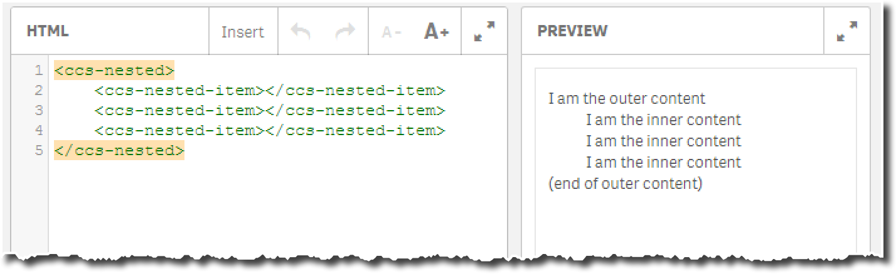

When developing more powerful and thus complex custom components, you'll probably run into the requirement that you'd like to implement nested components.

As described above, the Custom Component API returns the signature of **one** AngularJS directive, so how would you return a set of directives.
The answer is simple: Just return an array of object instead of a single one:

```js
define( [], function () {
    'use strict';
    
    return [
            {
                // definition of component 1
            },
            {
                // definition of component 2
            }
        ];
    
} );
```


The following example showcases how to use this approach:

As a result of this component it should be possible to add nested components to a Widget like this one:

```html
<ccs-nested>
    <ccs-nested-item></ccs-nested-item>
    <ccs-nested-item></ccs-nested-item>
</ccs-nested>
```


The `ccs-nested.qext` file:

```js
{
  "name": "ccs-nested",
  "description": "Example of a nested component.",
  "type": "component",
  "version": "0.1.0",
  "author": "Stefan Walther"
}
```

The `ccs-outer.js` file returns an array of components, including `ccsNested`and `ccsNestedItem`: 

```js
define( [], function () {
    'use strict';

    return [
        {
            name: "ccsNested",
            restrict: 'E',
            transclude: true,
            template: '<div>I am the outer content<div ng-transclude></div>(end of outer content)</div>'
        },
        {
            name: "ccsNestedItem",
            restrict: 'E',
            require: '^ccsNested',
            template: '<div style="margin-left:30px;">I am the inner content</div>'
        }
    ];
} );
```

Result:




It goes far beyond this tutorial to cover how to create nested components in AngularJS, therefore some further readings are provided:

- [Directive to Directive communication with "require"](https://toddmotto.com/directive-to-directive-communication-with-require/)
- [A Practical Guide to AngularJS Directives (Part Two)](https://www.sitepoint.com/practical-guide-angularjs-directives-part-two/)